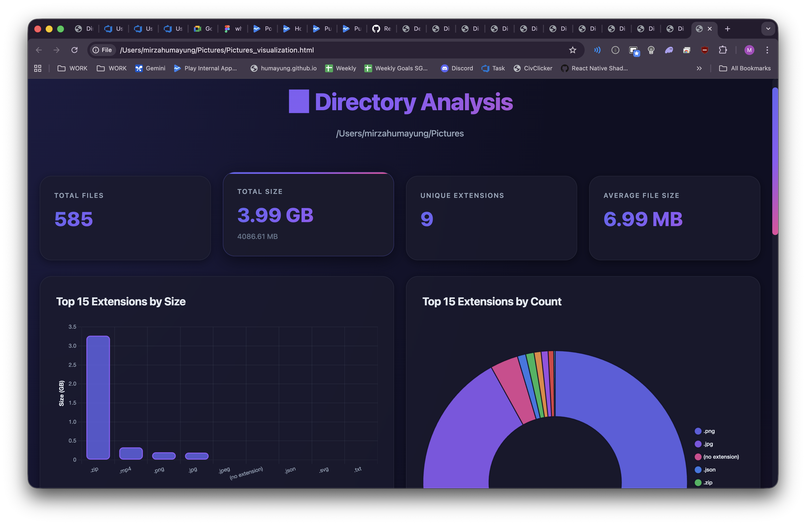
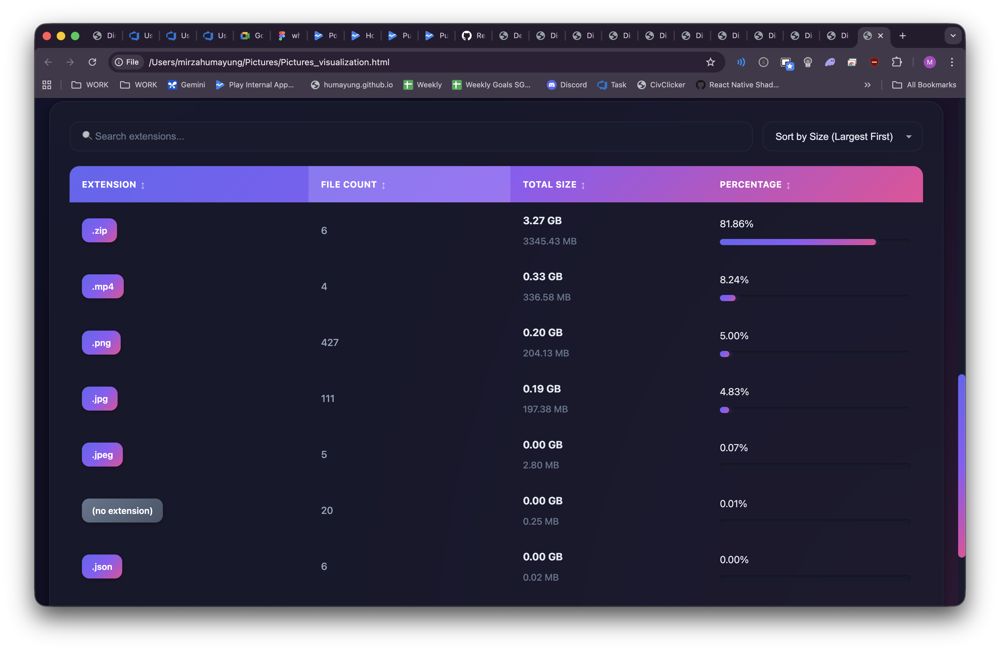

# disk-analyzer

Quick script to analyze whats taking up space in your directories. Shows you file extensions, counts, and sizes in a nice HTML dashboard.

## What it does

Scans a directory (recursively) and:
- Counts files by extension
- Calculates total size per extension
- Generates a pretty HTML visualization (dark mode, because why not)
- All data is embedded in the HTML, no JSON files needed





## Usage

```bash
python analyze_directory.py /path/to/directory
```

Thats it. It'll generate an HTML file in the target directory and open it in your browser.

### Options

- `--no-open`: Dont auto-open the browser
- `--no-progress`: Shut up, no progress messages


## Example

```bash
python analyze_directory.py ~/Downloads
```

This will:
1. Scan everything in Downloads
2. Generate `directory_visualization.html` in the Downloads folder with embedded data
3. Open it in your browser

## Output

The HTML file contains:
- Summary (total files, total size, unique extensions)
- Breakdown by extension (count, size in bytes/MB/GB)
- Interactive charts and sortable table

The HTML is a standalone file - all data is embedded, so you can share it or open it anywhere. No server needed. The file is saved in the directory you analyzed.

## Requirements

- Python 3.6+
- Thats it. Uses standard library only.

## Notes

- Progress updates every 1000 files (so you know its not frozen)
- Handles permission errors gracefully (just skips those files)
- The HTML uses Chart.js from CDN, so you need internet for the charts to work
- Large directories might take a while. Go grab coffee.

## Files

- `analyze_directory.py` - The main script
- `visualize_analysis.html` - HTML template (gets data injected)
- `directory_visualization.html` - Generated HTML files with embedded data (saved in the analyzed directory)

## Why

Got tired of not knowing whats eating my disk space. Made this. It works.

---

**Note:** This project was made with help from AI. Its mainly for my private use, but feel free to use it if you find it useful. No guarantees though.

# directory-analyser
